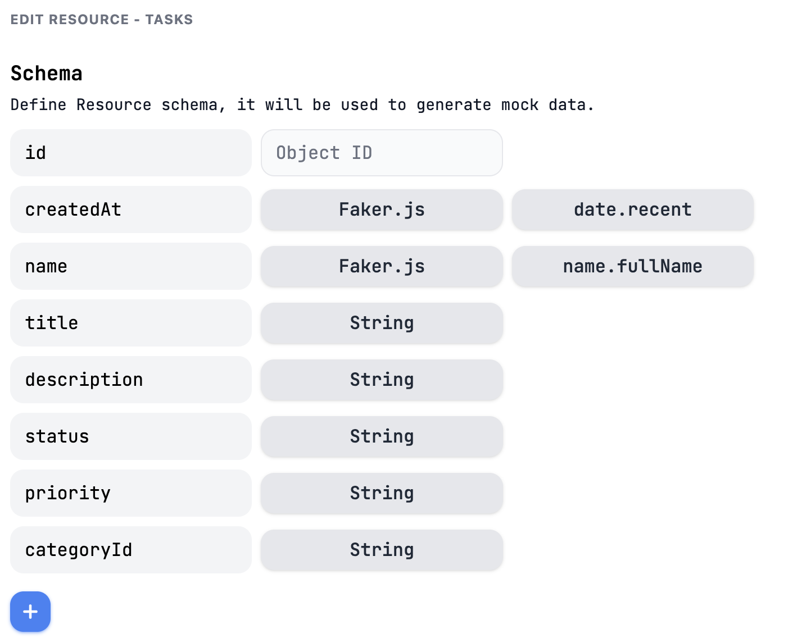
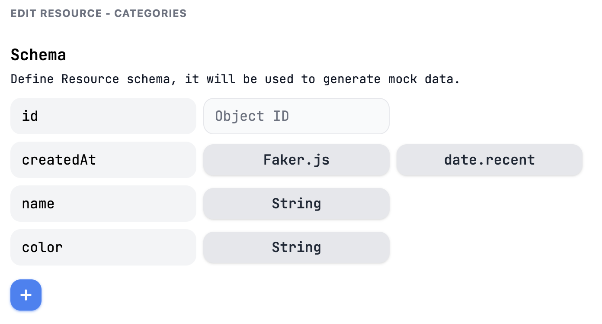
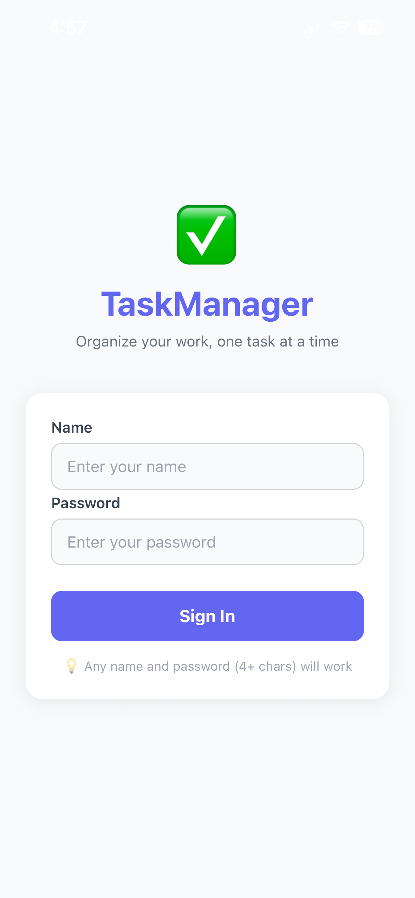
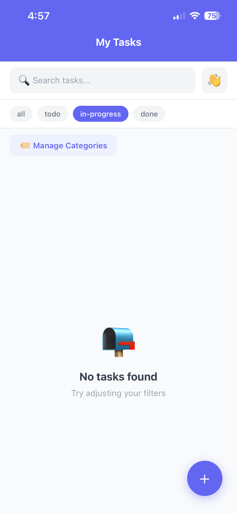
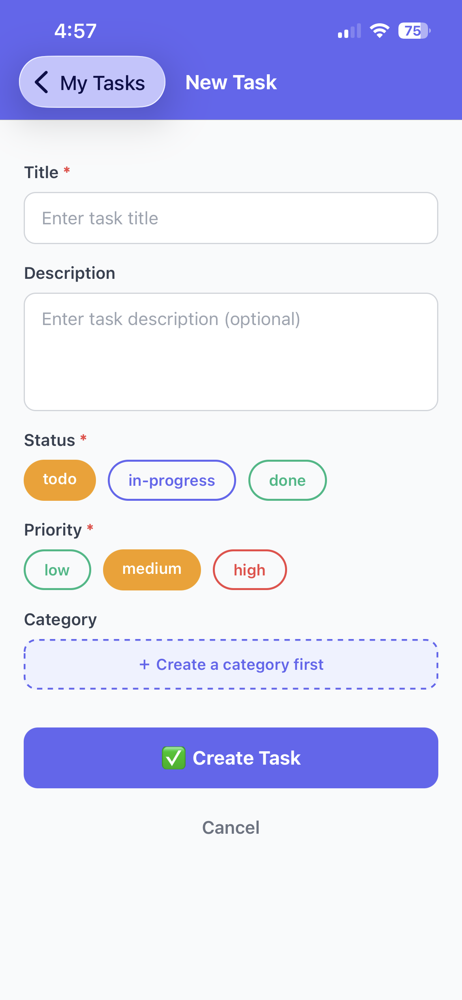
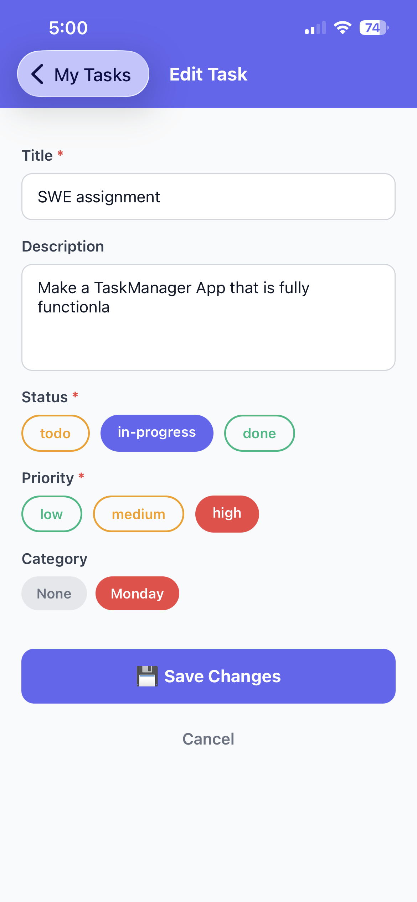

# TaskManager — React Native CRUD App

A mobile task management application built with React Native (Expo) and TypeScript
for the SWE201 Backend Software Engineering module (Assignment 3).

---

##  App Description

TaskManager lets users organize their work by creating, viewing, updating, and
deleting tasks. Tasks can be grouped into color-coded categories and filtered
by status. The app persists login sessions and filter preferences across restarts
using AsyncStorage.

---

##  Domain & Entities

### Primary Entity — Task
| Field | Type | Description |
|---|---|---|
| id | string | Auto-generated by mockapi |
| title | string | Task title (required, 2–100 chars) |
| description | string | Optional details (max 500 chars) |
| status | string | `todo`, `in-progress`, or `done` |
| priority | string | `low`, `medium`, or `high` |
| categoryId | string | Reference to a Category (optional) |
| createdAt | string | ISO timestamp |

### Secondary Entity — Category
| Field | Type | Description |
|---|---|---|
| id | string | Auto-generated by mockapi |
| name | string | Category label (required, 2–30 chars) |
| color | string | Hex color string (e.g. `#6366f1`) |
| createdAt | string | ISO timestamp |

---

##  State Management

**Approach: Context API + useReducer**

Chosen because:
- No extra libraries needed — built into React
- `useReducer` gives a clear, predictable state update pattern
- Scales well for a single-domain app of this size
- Easy to understand and debug for academic review

### Global State Shape
```typescript
{
  tasks: Task[];
  categories: Category[];
  user: { token: string; name: string } | null;
  filters: { status: string; categoryId: string; searchQuery: string };
  loading: boolean;
  error: string | null;
}
```

### Custom Hooks
| Hook | Purpose |
|---|---|
| `useAuth` | Login, logout, user session management |
| `useFetchTasks` | Fetch tasks + categories on mount with retry |
| `useForm` | Reusable form state, validation, and error handling |

---

##  Backend

**Service:** mockapi.io (free mock REST API)  
**Base URL:** `https://6a12cb6278d0434e0d5d7b0f.mockapi.io`

### Endpoints

| Method | URL | Purpose |
|---|---|---|
| GET | `/tasks` | Fetch all tasks |
| GET | `/tasks/:id` | Fetch a single task |
| POST | `/tasks` | Create a new task |
| PUT | `/tasks/:id` | Update an existing task |
| DELETE | `/tasks/:id` | Delete a task |
| GET | `/categories` | Fetch all categories |
| POST | `/categories` | Create a new category |
| DELETE | `/categories/:id` | Delete a category |

---

##  Project Structure
src/
├── api/
│   ├── config.ts           # Axios instance, base URL, interceptors
│   ├── tasksApi.ts         # Task CRUD API calls
│   └── categoriesApi.ts    # Category API calls
├── components/             # (reusable UI components)
├── hooks/
│   ├── useAuth.ts          # Authentication hook
│   ├── useFetchTasks.ts    # Data fetching hook with retry
│   └── useForm.ts          # Generic form management hook
├── navigation/
│   └── AppNavigator.tsx    # Stack navigator + route type definitions
├── screens/
│   ├── LoginScreen.tsx     # Sign in screen
│   ├── TaskListScreen.tsx  # Task list, search, filter
│   ├── TaskDetailScreen.tsx# Single task view
│   ├── TaskFormScreen.tsx  # Create and edit task
│   └── CategoryScreen.tsx  # Category management
├── store/
│   ├── AppContext.tsx      # Context provider + rehydration
│   ├── reducer.ts          # Pure reducer function
│   └── types.ts            # All TypeScript interfaces and types
└── utils/
├── storage.ts          # AsyncStorage helper functions
└── validators.ts       # Field validation functions

---

##  Setup Instructions

### Prerequisites
- Node.js 18+
- Expo CLI (`npm install -g expo-cli`)
- Expo Go app on your phone (iOS or Android)

### 1. Clone the repository
```bash
git clone <your-repo-url>
cd TaskManager
```

### 2. Install dependencies
```bash
npm install
```

### 3. Start the app
```bash
npx expo start
```

### 4. Open on your phone
- Scan the QR code in the terminal with the **Expo Go** app
- Works on both iOS and Android

### 5. Backend
No setup needed — the app uses a live mockapi.io backend that is
already running at:
https://6a12cb6278d0434e0d5d7b0f.mockapi.io

---

##  Screenshots
1. Login page

2. TaskList

3. TaskForm

4. TaskDetail

---

##  Features Implemented

- [x] Authentication (dummy token, persisted via AsyncStorage)
- [x] Create task with client-side validation
- [x] Read — list view with search and status filter
- [x] Read — detail view for a single task
- [x] Update — edit form pre-filled with existing data
- [x] Delete — confirmation alert, removed from backend and UI
- [x] Category management (create, list, delete)
- [x] Loading indicators on all network operations
- [x] Error messages for network and server errors
- [x] Retry mechanism on failed requests
- [x] Empty states on list and category screens
- [x] Pull-to-refresh on task list
- [x] AsyncStorage persistence for session and filters
- [x] State rehydration on app start

---

##  Known Limitations

- Authentication is dummy (no real auth backend) — any name and
  password (4+ characters) will work
- Categories cannot be edited, only created and deleted
- No pagination — all tasks are loaded at once
- mockapi.io free tier has a limit of 100 objects per resource

---

##  Tech Stack

| Technology | Purpose |
|---|---|
| React Native (Expo) | Mobile app framework |
| TypeScript | Type safety |
| React Context + useReducer | Global state management |
| AsyncStorage | Local persistence |
| Axios | HTTP client |
| React Navigation | Screen navigation |
| mockapi.io | Mock REST backend |