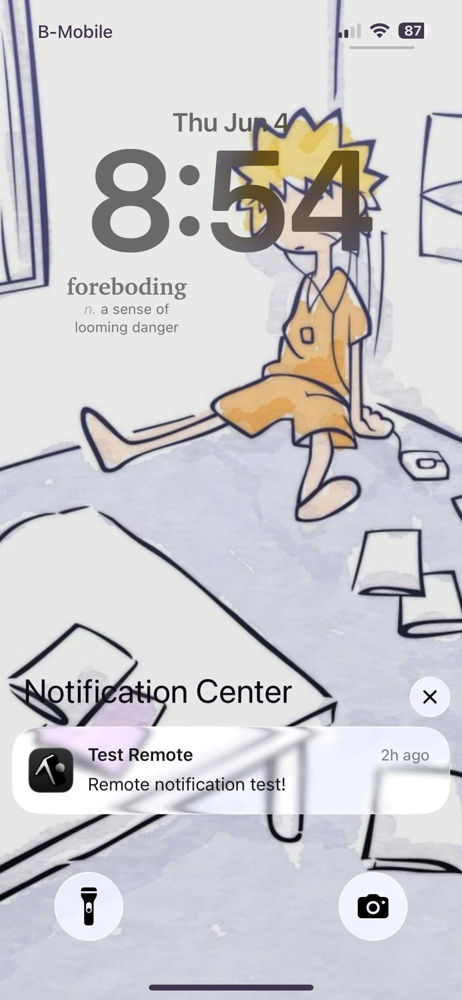
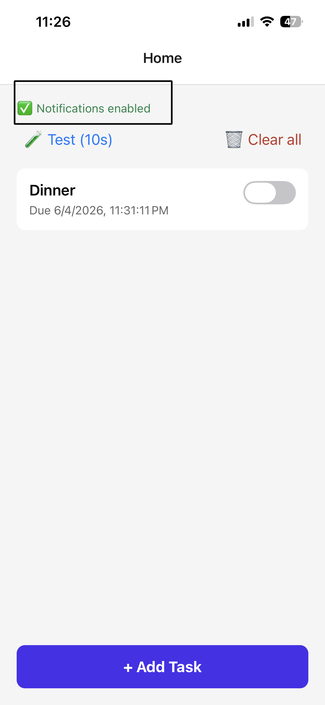
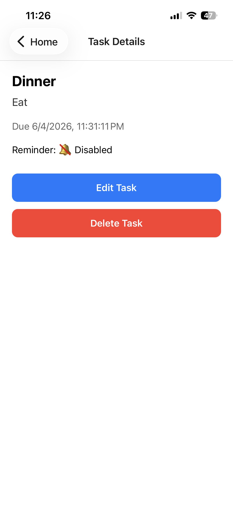
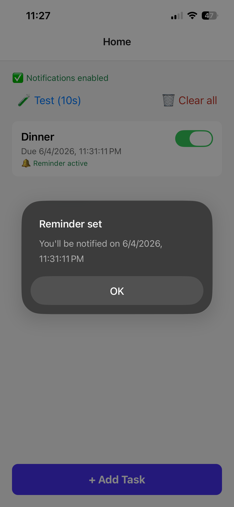
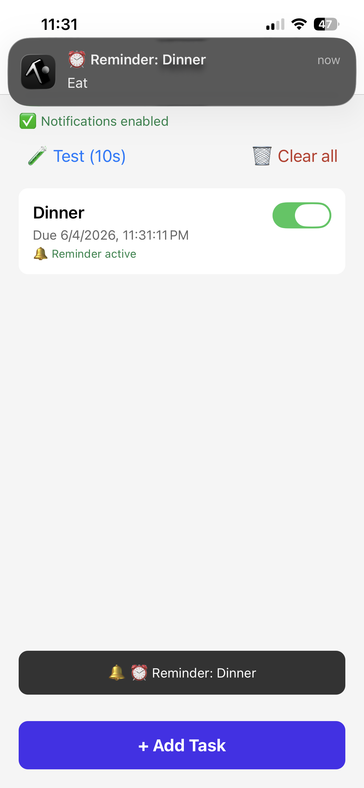

# Assignment 4

This Assingment uses a React Native Expo task reminder app. Users can create personal tasks, choose a due date/time, enable local reminders, and open the relevant task detail screen by tapping a notification. The project also includes a small Node/Express backend for server-triggered Expo push notifications.

## Domain and Notification Scenario

**Domain:** Personal productivity and task reminders.

**Main notification scenario:** A user creates a task such as “Dinner” or “Submit assignment,” sets a due date/time, and enables a reminder. When the reminder fires, the notification appears on the device. Tapping the notification opens the app and navigates directly to the task detail screen for that reminder.

The app also supports a remote/server-triggered notification scenario where the backend stores Expo push tokens and can send a push notification to all registered devices or one selected device.

## Features

- Create tasks with title, description, due date/time, and repeat mode.
- View tasks in a list on the home screen.
- Open a task detail screen tied to the notification payload.
- Enable or disable reminders per task.
- Cancel all scheduled reminders.
- Schedule a test notification after 10 seconds for demonstration.
- Register the device for remote Expo push notifications.
- Send remote push notifications through a protected Express backend.

## Notification Types Implemented

### 1. Local Reminder Notifications

Local notifications are scheduled directly on the device using `expo-notifications`.

Implemented local reminder types:

- **One-time reminder:** Scheduled for the task’s selected due date/time.
- **Daily reminder:** Repeats every day at the selected hour and minute.
- **Test notification:** A demo notification scheduled to appear after 10 seconds.

The local scheduling logic is implemented in:

```txt
src/services/NotificationService.ts
```

Important functions:

```ts
scheduleTaskReminder(task)
cancelTaskReminder(notificationId)
cancelAllReminders()
```

### 2. Remote / Server-Triggered Push Notifications

Remote notifications are sent through the backend using the Expo Push API and `expo-server-sdk`.

The app registers its Expo push token with the backend when notification permission is granted. The backend stores tokens in memory and can trigger notifications through API endpoints.

Remote push registration is implemented in:

```txt
src/services/NotificationService.ts
```

Backend push sending is implemented in:

```txt
backend/server.js
```

## Notification Handling

### Foreground Notifications

When a notification arrives while the app is open:

- `Notifications.setNotificationHandler` allows the notification banner/list behavior and sound.
- `AppNavigator.tsx` also shows an in-app toast containing the notification title.

Relevant files:

```txt
src/services/NotificationService.ts
src/navigation/AppNavigator.tsx
```

### Background Notifications

When the app is in the background:

- The device system tray displays the notification.
- The Android notification channel `reminders` is used with high importance, vibration, light color, and default sound.

The Android channel is created in:

```ts
setupAndroidChannel()
```

### Tapped Notifications

When the user taps a notification:

- The app reads the notification data payload.
- The payload contains the related `taskId`.
- The navigation handler opens the `TaskDetail` screen.
- `TaskDetailScreen` looks up the task by ID from `TaskContext`.

Relevant navigation handling is in:

```txt
src/navigation/AppNavigator.tsx
```

The notification payload uses this shape:

```ts
data: {
  taskId: task.id,
  screen: 'TaskDetail'
}
```

Cold-start notification taps are handled using:

```ts
Notifications.useLastNotificationResponse()
```

Live foreground/background taps are handled using:

```ts
Notifications.addNotificationResponseReceivedListener(...)
```

## Backend Details

### Technology / Service Used

The backend uses:

- Node.js
- Express
- CORS
- dotenv
- expo-server-sdk
- Expo Push API

The backend stores registered device tokens in an in-memory `Map`. This is suitable for a demo, but a production app would use a persistent database.

### Backend Base URL

The app reads the backend URL from `app.json`:

```json
"extra": {
  "apiUrl": "http://172.20.10.6:3000"
}
```

Change this URL to your computer’s LAN IP address when testing on a real phone.

### Main Endpoints

| Method | URL | Purpose | Protected |
|---|---|---|---|
| `GET` | `/` | Health check to confirm the backend is running. | No |
| `POST` | `/register` | Stores a device Expo push token. Called by the mobile app. | No |
| `POST` | `/notify` | Sends a remote push notification to all registered devices. | Yes, requires `x-api-key` |
| `POST` | `/notify/:deviceId` | Sends a remote push notification to one registered device. | Yes, requires `x-api-key` |
| `GET` | `/tokens` | Lists registered device IDs for diagnostics/testing. | No |

Protected endpoints require this request header:

```txt
x-api-key: YOUR_API_KEY
```

The key is configured in:

```txt
backend/.env
```

## Project Structure

```txt
Assignment 4/
├── App.tsx
├── app.json
├── package.json
├── index.ts
├── src/
│   ├── context/
│   │   └── TaskContext.tsx
│   ├── navigation/
│   │   └── AppNavigator.tsx
│   ├── screens/
│   │   ├── AddTaskScreen.tsx
│   │   ├── EditTaskScreen.tsx
│   │   ├── HomeScreen.tsx
│   │   └── TaskDetailScreen.tsx
│   ├── services/
│   │   └── NotificationService.ts
│   └── types/
│       ├── index.ts
│       └── navigation.ts
└── backend/
    ├── server.js
    ├── package.json
    └── .env.example
```

## Setup Instructions

### Prerequisites

Install the following:

- Node.js
- npm
- Expo CLI / Expo tooling
- Expo Go app on a physical device, or an Expo development build

A physical device is recommended because push notification tokens and real notification behavior are limited on simulators/emulators.

## Install Dependencies

From the project root:

```bash
npm install
```

For the backend:

```bash
cd backend
npm install
```

## Run the Expo App

From the project root:

```bash
npx expo start
```

Then scan the QR code with Expo Go or open the app in a development build.

Android command:

```bash
npm run android
```

iOS command:

```bash
npm run ios
```

## Run the Backend

From the backend folder:

```bash
cd backend
cp .env.example .env
npm install
npm start
```

The backend runs on:

```txt
http://localhost:3000
```

When testing from a physical phone, replace `localhost` with your computer’s LAN IP address in `app.json`:

```json
"apiUrl": "http://YOUR_COMPUTER_IP:3000"
```

Example:

```json
"apiUrl": "http://192.168.1.20:3000"
```

Restart the Expo app after changing `app.json`.

## Trigger a Remote Notification

### 1. Register a Device

Open the app on a real device and allow notifications. The app will attempt to register its Expo push token with the backend using:

```txt
POST /register
```

Check registered devices:

```bash
curl http://localhost:3000/tokens
```

### 2. Send a Broadcast Push Notification

```bash
curl -X POST http://localhost:3000/notify \
  -H "Content-Type: application/json" \
  -H "x-api-key: YOUR_API_KEY" \
  -d '{
    "title": "Task Reminder",
    "message": "You have a task reminder.",
    "data": {
      "screen": "TaskDetail",
      "taskId": "TASK_ID_HERE"
    }
  }'
```

### 3. Send a Push Notification to One Device

Replace `DEVICE_ID_HERE` with a device ID from `/tokens`.

```bash
curl -X POST http://localhost:3000/notify/DEVICE_ID_HERE \
  -H "Content-Type: application/json" \
  -H "x-api-key: YOUR_API_KEY" \
  -d '{
    "title": "Single Device Reminder",
    "message": "This push was sent to one device.",
    "data": {
      "screen": "TaskDetail",
      "taskId": "TASK_ID_HERE"
    }
  }'
```


## Demo Flow

### Local Reminder Demo

1. Open the app.
2. Grant notification permission.
3. Tap `+ Add Task`.
4. Enter a title and optional description.
5. Choose a future date/time.
6. Save the task.
7. Toggle the reminder switch on for that task.
8. Background the app.
9. Wait for the reminder notification.
10. Tap the notification to navigate to the task detail screen.

### Test Notification Demo

1. Tap the `Test (10s)` button on the home screen.
2. Background the app.
3. Wait about 10 seconds.
4. Confirm that the notification appears in the system tray.

### Remote Push Demo

1. Start the backend.
2. Start the Expo app on a physical device or development build.
3. Allow notification permission.
4. Confirm the device appears in `GET /tokens`.
5. Use `POST /notify` or `POST /notify/:deviceId` to send a remote notification.
6. Tap the notification and confirm that the app opens.

## Screenshots

###  Screenshot 1: Permission granted Screen



### Required Screenshot 2: Entity List or Detail Tied to Notifications




### Required Screenshot 3: Notification Received on Device


## Limitations

- The app was designed for Expo and React Native.
- A physical device is recommended for testing notifications.
- Remote push notifications require a valid Expo push token and EAS project configuration.
- Android remote push may require a development build instead of Expo Go, depending on the Expo SDK and device environment.
- The backend stores device tokens in memory, so registered tokens are lost when the backend restarts.
- Tasks are stored in React state through `TaskContext`; they are not persisted to storage, so tasks reset when the app restarts.
- The backend URL in `app.json` is environment-specific and must be changed to match the tester’s local network.
- iOS remote push requires a real iOS device and proper Apple push notification configuration through Expo/EAS.
