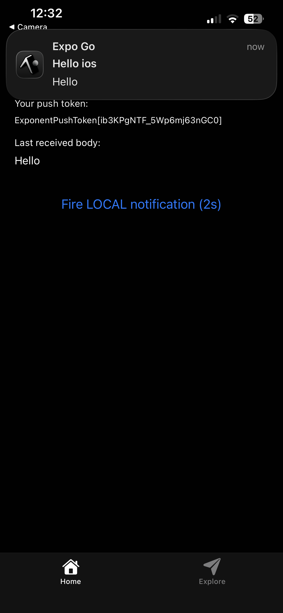

# PushDemo — Expo Push Notifications Practical

A concise guide for the PushDemo practical: integrating remote push notifications in an Expo React Native app using Expo Notifications and EAS.

**What this repo contains**
- A sample Expo app demonstrating push notification registration and handling.

## Quick Overview
This practical shows how to:
- Register the device for push notifications and obtain an Expo push token.
- Send test notifications using the Expo dashboard or a backend using the Expo push API.
- Configure `app.json` for Android/iOS and EAS.

## Requirements
- Node.js 20+ and npm
- Expo CLI & EAS CLI (`npm install -g eas-cli`)
- An Expo account (free)
- A physical Android device for testing remote pushes (recommended)

## Setup
1. Install dependencies:

```bash
npm install
npx expo install expo-notifications expo-device expo-constants
```


2. Login and initialise EAS (if not done):

```bash
eas login
eas init
```


3. Ensure `app.json` is configured with your identifiers and `extra.eas.projectId` (created by `eas init`). Example keys to check:

- `expo.ios.bundleIdentifier`
- `expo.android.package`
- `expo.plugins` includes `expo-notifications` when required

## Common Scripts
- `npm start` — start the Expo dev server
- `npm run android` — open on Android
- `npm run ios` — open on iOS (macOS only)
- `npm run web` — run web build

## Sending a Test Notification

1. Run the app on a real device or development build and copy the Expo push token printed by the app.
2. From the Expo dashboard (https://expo.dev/notifications) paste the token, set Title/Body and send.



Or send from a backend using the Expo push API (node example):

```js
import { Expo } from 'expo-server-sdk';
const expo = new Expo();
const messages = [{ to: EXPO_PUSH_TOKEN, sound: 'default', title: 'Hello', body: 'World', data: { screen: 'Home' } }];
await expo.sendPushNotificationsAsync(messages);
```

Note: For Android remote pushes with newer Expo SDKs you may need a development build (not Expo Go).

## Troubleshooting
- "Project ID not found": run `eas init` to populate `extra.eas.projectId` in `app.json`.
- `DeviceNotRegistered` ticket error: token is stale; re-register the device and update your backend.
- Pushs not received on Android: ensure you built a development/standalone build and configured FCM credentials if required.

## Project Structure (high level)
- `app/` — app routes and UI
- `components/` — reusable UI components
- `assets/` — images and media
- `scripts/` — helper scripts (e.g., `reset-project.js`)
- `app.json`, `package.json`, `tsconfig.json` — project config

